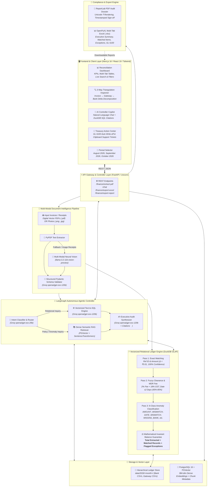
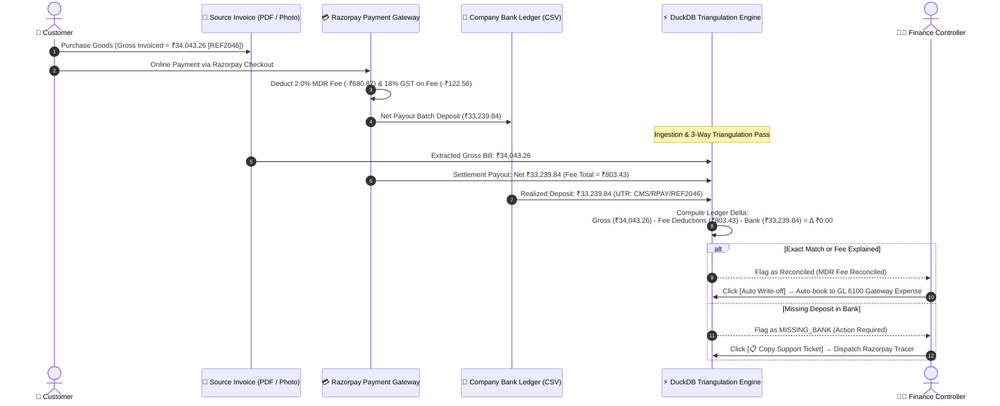

# Nexus AI Reconciler

> **Track 04: AI Finance Controller — Run the books and the cash position**  
> *Razorpay Buildathon 2026*  
> 🌐 **Live Cloud Deployment**: [http://44.203.41.225:3000/](http://44.203.41.225:3000/) *(Hosted on AWS EC2 Ubuntu Pro)*
> **Video Explanation**: [https://drive.google.com/drive/u/0/folders/17Nm9UM-pBL18qUZI8MbmKnQ536WIuPvc](https://drive.google.com/drive/u/0/folders/17Nm9UM-pBL18qUZI8MbmKnQ536WIuPvc)

**Nexus AI Reconciler** is an autonomous, multi-source financial reconciliation engine and AI Finance Controller powered by **DuckDB**, **LangGraph**, **Groq LLMs (`openai/gpt-oss-120b` & `openai/gpt-oss-20b`)**, **PGVector**, **ReportLab**, and **OpenPyXL**.

---

## ⚡ Core LLM Architecture (Groq LPU Inference)

Our system replaces legacy monolithic prompts with a tiered, multi-agent AI pipeline hosted on **Groq LPU high-throughput inference**:

| Agent / Subsystem | Model | Purpose & Execution SLA |
|---|---|---|
| **Intent Classifier & Router** | `openai/gpt-oss-20b` | Sub-50ms query classification routing requests to DuckDB SQL, Semantic RAG, or Cash Forecasting pipelines. |
| **Deterministic Text-to-SQL Engine** | `openai/gpt-oss-120b` | Zero-hallucination translation of complex financial natural language inquiries into vectorized DuckDB SQL queries. |
| **Multi-Modal Invoice Extractor** | `openai/gpt-oss-120b` | Structured Pydantic schema validation parsing raw multi-page OCR text into validated `InvoiceRecord` entities. |
| **Executive Audit Synthesizer** | `openai/gpt-oss-120b` | Generates auditable executive summaries with transparent SQL citations, ledger metrics, and balance invariant proofs. |
| **Vision OCR Fallback** | `llama-3.2-11b-vision-preview` | Multi-modal neural vision fallback for low-density photographed receipts and mobile invoice snapshots. |

---

## 🚀 Key Platform Features

### 1. Vectorized Multi-Pass DuckDB Reconciliation Engine
* **Pass 1 — Exact Matching**: Sub-millisecond vectorized pairing on transaction reference ID and exact monetary value ($\Delta < ₹0.01$).
* **Pass 2 — Tolerant & Fuzzy Matching**: Models real-world gateway processing fee deductions (2.0% MDR + 18% GST) and $T+1 / T+2$ bank clearance date shifts with dynamic confidence scoring (65%–85%).
* **Pass 3 — Actionable Exception Taxonomy (6 Standard Classes)**:
  * `AMOUNT_MISMATCH`: Net variance flagged due to irregular gateway MDR fee deductions or GST rate discrepancies.
  * `DATE_MISMATCH`: Settlement date clearing variance extending beyond the allowable $T+2$ bank clearance window.
  * `MISSING_BANK`: Gateway payout record logged with no corresponding corporate bank ledger credit.
  * `MISSING_GATEWAY`: Bank deposit found referencing a merchant tag without an originating Razorpay payout batch.
  * `FEE_MISMATCH`: Gateway fee charged diverges from negotiated contract schedule.
  * `STATUS_MISMATCH`: Invoice marked PAID in ERP but gateway settlement flagged failed or refunded.
* **Mathematical Invariant Guarantee**:
  $$\text{Total Ingested Volume} \equiv \text{Matched Records} + \text{Flagged Exceptions}$$

### 2. 3-Way Cross-Ledger Triangulation Inspector
* **Visual Ledger Alignment**: Decomposes transactions across:
  1. **Source Invoice** (Reference ID, Document Date, Billed Status, Gross Invoice Total)
  2. **Razorpay Gateway Report** (Payout Batch, 2% MDR Fee Deduction, 18% GST Split, Net Expected)
  3. **Bank Statement** (Value Date, UTR / Clearing Narration, Bank Deposited Amount)
* **Audit Variance Decomposition**: Real-time delta decomposition ($\Delta$) with automated root-cause detection and actionable next steps.

### 3. Treasury Resolution & Action Center
* **One-Click Auto Write-off**: Automatically journal minor fee rounding variances ($\le ₹5.00$) straight to **GL 6100 — Payment Gateway Fee Expense**.
* **One-Click Razorpay Support Ticket Generator**: Pre-populates formatted Markdown support tickets with transaction UTRs, payout batch IDs, and monetary deltas, copied instantly to the controller's clipboard.
* **Treasury Assignment**: Direct re-queuing and assignment of delayed settlements to Treasury Specialists.

### 4. Explainable AI (XAI) with Transparent SQL Citations
* Deterministic financial answers backed by live data:
  * **Interactive SQL Citations**: Clickable badges revealing the exact DuckDB SQL query executed against the columnar tables.
  * **Document Citations**: Page-level references (e.g., `invoices_august_2026.pdf (p. 1)`) with text snippets retrieved from PGVector.

### 5. Multi-Tab Financial Excel & PDF Audit Dossier
* **Multi-Tab Excel Export (`.xlsx`)**: Generated via `openpyxl` with 4 dedicated sheets:
  - *Summary KPIs* (Processed volume, fee deductions, reconciliation health score)
  - *Matched Records* (Full cross-ledger clearing trail)
  - *Actionable Exceptions* (Classified anomalies with reason codes)
  - *Treasury Adjustments* (GL 6100 write-offs and ledger journal entries)
* **Official PDF Audit Dossier**: Generated via `ReportLab` featuring TrueType Unicode Indian Rupee (`₹`) rendering, statutory confidence intervals, and CFO ledger sign-off signposts.

---

## 🏛️ System Architecture & Data Flow

### 1. End-to-End System Topology



---

### 2. 3-Way Cross-Ledger Triangulation Sequence



---

## 📂 Repository Structure

```
razorpay-reconciler/
├── backend/
│   ├── app/
│   │   ├── agent/
│   │   │   ├── router.py               # LangGraph Controller (gpt-oss-20b Router + gpt-oss-120b SQL/Synthesizer)
│   │   │   └── pdf_reconciler.py       # Multi-Modal Invoice Extraction (gpt-oss-120b Pydantic + Vision)
│   │   ├── services/
│   │   │   ├── reconciliation.py       # Vectorized DuckDB Multi-Pass Triangulation Engine
│   │   │   └── pdf_report_generator.py # ReportLab PDF Audit Dossier Generator
│   │   ├── worker.py                   # Celery Background Ingestion Worker
│   │   └── main.py                     # FastAPI Endpoints & CORS Management
│   ├── generate_monthly_data.py        # Realistic Financial Dataset Generator (July, Aug, Sept, Oct 2026)
│   ├── Dockerfile                      # Backend Container Definition
│   └── requirements.txt                # Python Dependencies
│
├── frontend/
│   ├── app/
│   │   ├── page.tsx                    # Dual-Tab Dashboard (Reconciler + Copilot Chat + 3-Way Inspector)
│   │   └── layout.tsx                  # Root Next.js Layout
│   ├── Dockerfile                      # Frontend Container Definition
│   └── package.json                    # Node Dependencies
│
├── data/
│   ├── 2026/july/                      # July 2026 Dataset (PDFs, Razorpay CSVs, Bank CSVs)
│   ├── 2026/august/                    # August 2026 Dataset (PDFs, Razorpay CSVs, Bank CSVs)
│   ├── 2026/september/                 # September 2026 Dataset
│   └── 2026/october/                   # October 2026 Dataset
│
├── .github/workflows/
│   └── ci.yml                          # GitHub Actions CI Pipeline (Python Tests + Next.js Build)
├── docker-compose.yml                  # Full-Stack Multi-Container Orchestration
├── .env.example                        # Environment Variable Template
└── README.md                           # Documentation
```

---

## 🛠️ Quickstart Guide

### Prerequisites
* [Docker Desktop](https://www.docker.com/products/docker-desktop/) (Docker Compose v2+) OR Python 3.11+ & Node 18+
* [Groq API Key](https://console.groq.com/keys)

### 1. Clone & Configure Environment
```bash
git clone https://github.com/ro-lex404/reconciler.git
cd reconciler
cp .env.example .env
```

Edit `.env` and set your Groq API key:
```env
GROQ_API_KEY=gsk_your_groq_api_key_here
```

### 2. Launch with Docker Compose
```bash
docker compose up --build
```

### 3. Access the Live Dashboard
* **Frontend Web Application**: [http://localhost:3000](http://localhost:3000) (or live on AWS: [http://44.203.41.225:3000](http://44.203.41.225:3000))
* **FastAPI Interactive Swagger Docs**: [http://localhost:8000/docs](http://localhost:8000/docs)

---

## 🧪 Testing & Verification

```bash
# Backend Test Suite & Invariant Balance Verification
cd backend
python -m unittest discover -s tests -p "test_*.py" -v

# Frontend Production Build Check
cd ../frontend
npm run build
```

---

## 💬 Suggested AI Controller Inquiries

In the **AI Finance Controller Assistant** chat interface, test the following:
1. `"What is our net settlement variance for August 2026?"`
2. `"Show all exceptions where bank deposit is missing above ₹10,000"`
3. `"Why was reference REF2046 flagged and what is the gateway fee breakdown?"`
4. `"What is our projected cash settlement inflow for next week?"`
5. `"Summarize all fee overcharges and generate GL 6100 journal adjustment totals."`

---

## 📄 License
MIT License. Developed for the **Razorpay Buildathon 2026 (Track 04: AI Finance Controller — Run the books and the cash position)**.
