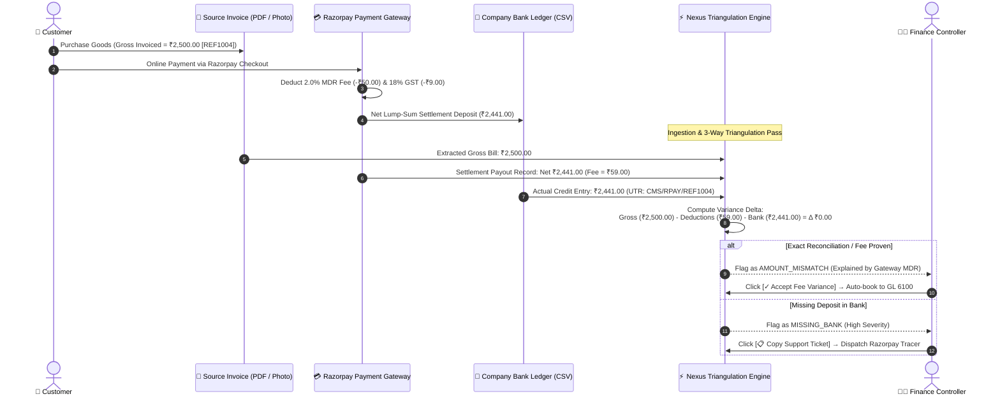

# Razorpay AI Finance Controller & Reconciliation Engine

> **Track 04: AI Finance Controller — Run the books and the cash position**  
> *Razorpay Buildathon 2026*  
> 🌐 **Live Cloud Deployment**: [http://44.203.41.225:3000/](http://44.203.41.225:3000/) *(Hosted on AWS EC2 Ubuntu Pro)*

An autonomous, multi-source financial reconciliation engine and AI Finance Controller powered by **DuckDB**, **LangGraph**, **Groq LLMs**, **PGVector**, and **ReportLab**.

---

## Key Features

### 1. Vectorized Multi-Pass DuckDB Reconciliation Engine
* **Pass 1 — Exact Matching**: Instant matching on transaction reference ID and exact monetary amount ($\Delta < ₹0.01$).
* **Pass 2 — Fuzzy Matching**: Tolerant matching for gateway fee rounding ($\Delta \le ₹5.00$) and T+1/T+2 bank clearance date shifts with dynamic confidence scoring (65%–85%).
* **Pass 3 — Actionable Exception Categorization (6 Standard Classes)**:
  * `AMOUNT_MISMATCH`: Variance flagged for gateway processing fee deduction or GST discrepancy.
  * `DATE_MISMATCH`: Settlement date clearing variance beyond T+2 bank clearance tolerance.
  * `MISSING_BANK`: Gateway settlement record with no corresponding bank ledger credit.
  * `MISSING_INVOICE`: Bank credit entry referencing valid merchant tag without ledger record.
  * `DUPLICATE`: Multiple ledger entries referencing identical merchant identifiers.
  * `GHOST_CREDIT`: Unreferenced bank credit with no corresponding gateway entry.
* **Multi-Format Date Normalization**: Automatically handles `DD-MM-YYYY`, `DD/MM/YYYY`, and `YYYY-MM-DD` timestamps without casting failures.

### 2. Explainable AI (XAI) Source Attribution & Citations
* Every response from the AI Finance Controller cites the exact evidence used:
  * **Document Badges**: Direct page-level citations (e.g., `invoices_august_2026.pdf (p. 1)`) with text snippets from PGVector.
  * **SQL Badges**: Cites active tabular datasets (e.g., `razorpay_settlements_august_2026.csv`, `bank_statement_august_2026.csv`).
* Zero hallucination proof for audit trails and compliance reviews.

### 3. Stateful LangGraph PDF Extractor & Reconciler
* Ingests multi-page invoice PDFs (`pypdf` + Groq LLM with structured Pydantic extraction).
* Dynamically reconciles extracted PDF invoice lines against bank settlements in DuckDB.
* Live memory injection synchronizes extracted invoice data directly into the agent's reasoning memory.

### 4. 7-Day Forward Cash Settlement Forecasting
* Automatically computes gross matched transaction volumes, gateway processing fees (2.0%), and applicable GST (18%).
* Projects upcoming net settlement inflows for next-week cash flow planning.

### 5. Official PDF Audit Report Generator
* One-click generation of executive reconciliation audit reports via **ReportLab**.
* Features TrueType Unicode Indian Rupee (`₹`) vector rendering, live generation timestamps, KPI summary metrics, and categorized exception tables.

---

## Architecture & System Design

### 1. End-to-End System Topology

```mermaid
flowchart TB
    subgraph ClientLayer["🖥️ Frontend & Client Layer (Next.js 16 / React 19 / Tailwind)"]
        UI_Dash["📊 Reconciliation Dashboard<br/><i>KPIs, Multi-Tab Tables, Live Search & Filters</i>"]
        UI_Inspector["🔍 3-Way Triangulation Inspector<br/><i>Invoice ↔ Gateway ↔ Bank Delta Decomposition</i>"]
        UI_QA["💬 Financial Q/A Agent<br/><i>Natural Language Chat + Paperclip Citations 📎</i>"]
        UI_Period["📅 Hierarchical Period Selector<br/><i>Multi-Year / Monthly Calendar Isolation</i>"]
        UI_Guide["📖 Interactive User Guide<br/><i>4-Stage Lifecycle & 6 Anomaly Class Matrix</i>"]
    end

    subgraph APILayer["⚡ API Gateway & Controller Layer (FastAPI / Uvicorn)"]
        API_Auth["🔐 Passcode Controller Auth"]
        API_Endpoints["🌐 REST Endpoints<br/><i>/finance/extract-pdf<br/>/finance/chat<br/>/finance/export-excel<br/>/finance/export-report</i>"]
        API_Async["⚡ Async Celery Task Dispatcher"]
    end

    subgraph MultiModal["📄 Multi-Modal Document Intelligence Pipeline"]
        direction TB
        Input_Doc["📥 Input Documents<br/><i>Digital Vector PDFs (.pdf) OR Scanned / Photo Receipts (.png, .jpg, .webp)</i>"]
        PyPDF_Node["📑 PyPDF Vector Parser"]
        OCR_Node["👁️ Tesseract Local OCR"]
        Vision_Node["🧠 Groq Vision Multi-Modal LLM<br/><i>(llama-3.2-11b-vision-preview)</i>"]
        Pydantic_Node["📐 Structured Pydantic Schema Validator<br/><i>(InvoiceRecord / ExtractedInvoiceList)</i>"]
        
        Input_Doc --> PyPDF_Node
        PyPDF_Node -- "Low Text Density" --> OCR_Node
        OCR_Node -- "Fallback / Phone Photos" --> Vision_Node
        PyPDF_Node & OCR_Node & Vision_Node --> Pydantic_Node
    end

    subgraph AgenticOrchestration["🤖 LangGraph Autonomous Agentic Orchestrator"]
        Router["🧭 Intent Classifier & Router<br/><i>(Llama 3.3 70B / 20B)</i>"]
        TextToSQL["⚙️ Deterministic Text-to-SQL Generator"]
        DenseRAG["📚 Dense Semantic RAG Retriever"]
        CashForecaster["📈 7-Day Forward Cash Forecaster<br/><i>(Gross - 2.0% MDR - 18% GST)</i>"]
        Synthesizer["✍️ Executive Audit Synthesizer<br/><i>Zero-Hallucination + Source Attribution 📎</i>"]
        
        Router -->|"Relational Inquiry"| TextToSQL
        Router -->|"Policy / Anomaly Inquiry"| DenseRAG
        Router -->|"Liquidity / Payout Inquiry"| CashForecaster
        TextToSQL & DenseRAG & CashForecaster --> Synthesizer
    end

    subgraph RelationalEngine["⚡ Vectorized Relational Ledger Engine (DuckDB OLAP)"]
        direction TB
        Pass1["Pass 1: Exact Matching<br/><i>Ref ID & Amount (Δ < ₹0.01, 100% Confidence)</i>"]
        Pass2["Pass 2: Fuzzy Clearing Shift<br/><i>Date ±3 Days Tolerance, Fee Delta ≤ ₹5.00 (65%-85%)</i>"]
        Pass3["Pass 3: Many-to-One Settlement Bundling<br/><i>Combinatorial Multi-Invoice to Single Bank Deposit</i>"]
        
        AnomalyFilter["🚨 Deterministic 6-Class Anomaly Engine<br/><i>• AMOUNT_MISMATCH  • DATE_MISMATCH<br/>• MISSING_BANK     • MISSING_INVOICE<br/>• DUPLICATE        • GHOST_CREDIT</i>"]
        
        Invariant["⚖️ Mathematical Invariant Balance Guarantee<br/><b>Total Extracted ≡ Matched Records + Flagged Exceptions</b>"]
        
        Pass1 --> Pass2 --> Pass3 --> AnomalyFilter --> Invariant
    end

    subgraph StorageLayer["💾 Storage & Vector Embeddings Layer"]
        H_Store["📁 Hierarchical Statement Store<br/><i>data/&lt;year&gt;/&lt;month&gt;/ (Bank CSVs, Gateway CSVs)</i>"]
        PG_Vector["🐘 PostgreSQL 16 + PGVector<br/><i>384-dim Dense Embeddings + Chunk Metadata</i>"]
        Redis_Queue["⚡ Redis Message Broker + Celery Worker"]
    end

    subgraph ComplianceExport["📑 Compliance & Export Engine"]
        PDF_Gen["📄 ReportLab PDF Audit Generator<br/><i>Unicode ₹ Rendering, Timestamped Executive Report</i>"]
        Excel_Gen["📊 OpenPyXL Multi-Tab Excel Generator<br/><i>Executive Summary, Matched Items, Exceptions (.xlsx)</i>"]
    end

    %% Wiring connections
    ClientLayer <==>|"REST / JSON"| APILayer
    APILayer --> MultiModal
    MultiModal --> AgenticOrchestration
    MultiModal --> RelationalEngine
    APILayer <--> AgenticOrchestration
    AgenticOrchestration <--> RelationalEngine
    AgenticOrchestration <--> StorageLayer
    RelationalEngine <--> H_Store
    APILayer --> StorageLayer
    StorageLayer <--> Redis_Queue
    APILayer --> ComplianceExport
    ComplianceExport -.->|"Downloadable Files"| ClientLayer
```



---

### 2. 3-Way Cross-Ledger Triangulation & Settlement Flow



---

## Repository Structure

```
razorpay-reconciler/
├── backend/
│   ├── app/
│   │   ├── agent/
│   │   │   ├── router.py               # LangGraph Router, SQL Node, RAG Node & Synthesizer
│   │   │   └── pdf_reconciler.py       # LangGraph PDF Extraction & Reconciliation Workflow
│   │   ├── services/
│   │   │   ├── reconciliation.py       # Vectorized DuckDB Multi-Pass Matching Engine
│   │   │   └── pdf_report_generator.py # ReportLab PDF Audit Report Generator
│   │   ├── worker.py                   # Celery Worker for Background Vector Ingestion
│   │   └── main.py                     # FastAPI REST API Endpoints
│   ├── generate_monthly_data.py        # Automated Dataset Generator for any Month/Year
│   ├── Dockerfile                      # Backend Container Definition
│   └── requirements.txt                # Python Dependencies
│
├── frontend/
│   ├── app/
│   │   ├── page.tsx                    # Dual-Tab Dashboard (Reconciler + AI Agent Chat)
│   │   └── layout.tsx                  # Root Next.js Layout
│   ├── Dockerfile                      # Frontend Container Definition
│   └── package.json                    # Node Dependencies
│
├── data/
│   ├── 2026/july/                      # July 2026 Dataset (PDFs, Razorpay CSVs, Bank CSVs)
│   └── 2026/august/                    # August 2026 Dataset (PDFs, Razorpay CSVs, Bank CSVs)
│
├── .github/workflows/
│   └── ci.yml                          # GitHub Actions CI Pipeline (Python Tests + Next.js Build)
├── docker-compose.yml                  # Full-Stack Multi-Container Orchestration
├── .env.example                        # Environment Variable Template
└── README.md                           # Documentation
```

---

## Quickstart Guide

### Prerequisites
* [Docker Desktop](https://www.docker.com/products/docker-desktop/) (Docker Compose v2+)
* [Groq API Key](https://console.groq.com/keys)

### 1. Clone & Configure Environment
```bash
git clone https://github.com/ro-lex404/reconciler.git
cd reconciler
cp .env.example .env
```
Edit `.env` and add your Groq API key:
```env
GROQ_API_KEY=gsk_your_groq_api_key_here
```

### 2. Launch with Docker Compose
```bash
docker compose up --build
```

### 3. Open the Application
* **Frontend Web Dashboard**: `http://localhost:3000`
* **Interactive Swagger API Docs**: `http://localhost:8000/docs`

---

## Testing & Verification

### Running Tests Locally
```bash
# Backend Test & Reconciliation Verification
$env:PYTHONPATH="backend"
python -m unittest discover -s backend/tests -p "test_*.py" -v

# Frontend Build & Typecheck
cd frontend
npm run build
```

---

## Suggested Prompt Inquiries

In the **AI Controller Chat** tab, test queries such as:
1. `"What's the total unreconciled amount?"`
2. `"Why was REF1004 flagged?"`
3. `"Show me all exceptions above ₹1,000"`
4. `"What is the projected settlement inflow next week?"`
5. `"Why was REF2004 flagged in August?"`

---

## License
MIT License. Built for the Razorpay Buildathon 2026 (Track 04: AI Finance Controller).
